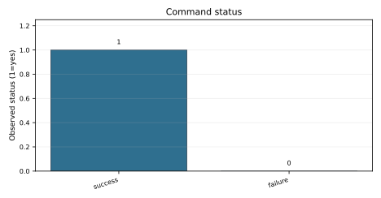
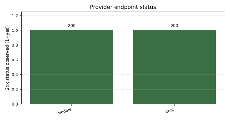
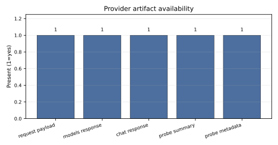
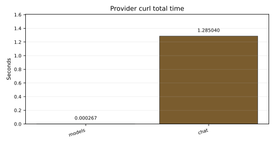

# external-runtime 20260526-canon6-provider-probe Report

## Summary

This is a canonical provider probe run created by `run.sh --prompt-id local-provider-ready` after lab-owned tooling and prompt catalog cleanup.

## Prompt

- Prompt id: local-provider-ready
- Prompt kind: provider-chat
- Prompt payload: `assets/prompt.json`
- Provider request payload: `assets/local-provider-probe/chat-request.json`

## Runtime Target

# Local Provider Probe

Status: local lab observation.

| Field | Value |
|---|---|
| Host | `127.0.0.1` |
| Port | `43117` |
| API base | `http://127.0.0.1:43117/v1` |
| Model | `qwen-local` |
| Prompt | `Rispondi in una frase: provider locale pronto sulla porta 43117.` |
| Max tokens | `96` |
| Temperature | `0` |
| Created UTC | `2026-05-26T16:10:20Z` |

## Endpoint Results

| Probe | Curl status | HTTP code | Time seconds |
|---|---:|---:|---:|
| `GET /v1/models` | 0 | 200 | 0.000267 |
| `POST /v1/chat/completions` | 0 | 200 | 1.285040 |

## Chat Preview

```text

```

## Files

- `meta.json`
- `models.json`
- `models.curl-meta.txt`
- `models.stderr.txt`
- `chat-request.json`
- `chat.json`
- `chat.curl-meta.txt`
- `chat.stderr.txt`

## Execution Result

```sh
docs/labs/_shared/bin/probe-local-provider.sh --host ${YAI_PROVIDER_HOST:-127.0.0.1} --port ${YAI_PROVIDER_PORT:-43117} --prompt-id local-provider-ready
```

Exit code: 0

## Metrics

`metrics.json` records the command exit code and endpoint metadata when available.

## Evidence / Artifacts

- `assets/command.stderr.txt`
- `assets/command.stdout.txt`
- `assets/local-provider-probe/chat-request.json`
- `assets/local-provider-probe/chat.curl-meta.txt`
- `assets/local-provider-probe/chat.json`
- `assets/local-provider-probe/chat.stderr.txt`
- `assets/local-provider-probe/meta.json`
- `assets/local-provider-probe/models.curl-meta.txt`
- `assets/local-provider-probe/models.json`
- `assets/local-provider-probe/models.stderr.txt`
- `assets/local-provider-probe/summary.md`
- `assets/prompt.json`
- `assets/prompt.txt`

## Limitations

This run makes no provider quality claim, model quality claim, hardware benchmark claim or benchmark superiority claim.

<!-- yai-generated-report:start -->
## Run evidence summary

This generated section is composed from existing run files only: `transcript.md`, `metrics.json`, `manifest.json` and `assets/`.

| Field | Value | Source |
| --- | --- | --- |
| Lab | external-runtime | metrics.json / manifest.json |
| Run slug | 20260526-canon6-provider-probe | metrics.json / manifest.json |
| Command exit code | 0 | metrics.json:command_exit_code |
| commands | 1 | transcript.md + assets/ |
| stdout files | 1 | transcript.md + assets/ |
| stderr files | 1 | transcript.md + assets/ |
| prompts | 1 | transcript.md + assets/ |
| responses | 1 | transcript.md + assets/ |
| receipts | 0 | transcript.md + assets/ |
| errors | 0 | transcript.md + assets/ |
| models endpoint HTTP code | 200 | metrics.json:measurements |
| chat endpoint HTTP code | 200 | metrics.json:measurements |

## What was executed

| Item | Value | Source |
| --- | --- | --- |
| Command | `docs/labs/_shared/bin/probe-local-provider.sh --host ${YAI_PROVIDER_HOST:-127.0.0.1} --port ${YAI_PROVIDER_PORT:-43117} --prompt-id local-provider-ready` | transcript.md |
| Exit code | 0 | metrics.json |
| Prompt id | local-provider-ready | metrics.json:measurements |
| Resolved prompt payload | `assets/prompt.json` | assets/prompt.json |

## Metrics table

| Metric | Value | Source |
| --- | --- | --- |
| status | command_recorded | metrics.json:status |
| command_exit_code | 0 | metrics.json:command_exit_code |
| prompt_id | local-provider-ready | metrics.json:measurements |
| prompt_kind | provider-chat | metrics.json:measurements |
| models_http_code | 200 | metrics.json:measurements |
| chat_http_code | 200 | metrics.json:measurements |
| models_remote_ip | 127.0.0.1 | metrics.json:measurements |
| chat_remote_ip | 127.0.0.1 | metrics.json:measurements |
| prompt_tokens | 28 | assets/local-provider-probe/chat.json:usage |
| completion_tokens | 96 | assets/local-provider-probe/chat.json:usage |
| total_tokens | 124 | assets/local-provider-probe/chat.json:usage |
| prompt_ms | 18.873 | assets/local-provider-probe/chat.json:timings |
| predicted_ms | 1265.48 | assets/local-provider-probe/chat.json:timings |
| prompt_per_second | 52.9857 | assets/local-provider-probe/chat.json:timings |
| predicted_per_second | 75.8607 | assets/local-provider-probe/chat.json:timings |

## Generated figures

### C001 - Command status



Caption: The recorded command exit code is 0. Diagnostic figure.

Source data: `metrics.json:command_exit_code`

Limitation: Diagnostic execution status only; this is not a benchmark or quality measurement.

### C002 - Provider endpoint status



Caption: models HTTP 200, chat HTTP 200

Source data: `metrics.json:measurements`

Limitation: Endpoint reachability is provider evidence, not provider quality or model quality.

### C003 - Provider response artifact availability



Caption: 5 of 5 checked provider artifacts are present. Diagnostic figure.

Source data: `manifest.json:assets`, `assets/local-provider-probe/`

Limitation: Diagnostic presence chart only; prefer the artifact index table for exact paths.

### C004 - Provider response time



Caption: models 0.000267s, chat 1.285040s

Source data: `assets/local-provider-probe/models.curl-meta.txt`, `assets/local-provider-probe/chat.curl-meta.txt`

Limitation: Curl total time is a probe observation, not a throughput or hardware benchmark.

## Artifact index

| Path | Class | Present |
| --- | --- | --- |
| assets/C001-command-status.svg | generated figure | yes |
| assets/C002-provider-endpoint-status.svg | generated figure | yes |
| assets/C003-response-artifact-presence.svg | generated figure | yes |
| assets/C004-provider-response-time.svg | generated figure | yes |
| assets/command.stderr.txt | log | yes |
| assets/command.stdout.txt | log | yes |
| assets/generated-figures.json | generated figure index | yes |
| assets/generated-tables.md | generated report tables | yes |
| assets/local-provider-probe/chat-request.json | json data | yes |
| assets/local-provider-probe/chat.curl-meta.txt | log | yes |
| assets/local-provider-probe/chat.json | json data | yes |
| assets/local-provider-probe/chat.stderr.txt | log | yes |
| assets/local-provider-probe/meta.json | json data | yes |
| assets/local-provider-probe/models.curl-meta.txt | log | yes |
| assets/local-provider-probe/models.json | json data | yes |
| assets/local-provider-probe/models.stderr.txt | log | yes |
| assets/local-provider-probe/summary.md | markdown artifact | yes |
| assets/prompt.json | prompt artifact | yes |
| assets/prompt.txt | prompt artifact | yes |

## Missing measurements

- Benchmark throughput, hardware, VRAM and model-quality measurements: Not measured

## Interpretation

- The recorded command completed successfully for this run.
- The provider probe recorded endpoint status evidence: models HTTP 200, chat HTTP 200.
- The provider response includes token/timing fields that can support future measurement reports.
- No model-quality or benchmark conclusion is drawn from this run.

## Limitations

- Generated evidence is derived only from existing run metrics and assets.
- The report makes no model-quality or benchmark superiority claim.
- Diagnostic figures show evidence availability or status; they do not measure quality.
- Provider probe observations describe endpoint behavior for this run only.

## Next run

- Repeat the provider probe only when endpoint state changes.
- Keep any throughput or model-quality evaluation in a separate benchmark run with explicit measurements.

Generated table attachment: `assets/generated-tables.md`
<!-- yai-generated-report:end -->
