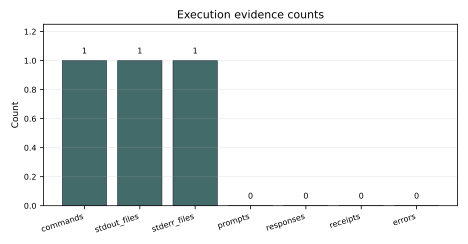

# filesystem-loop 20260526-canon6-smoke Report

## Summary

This is a canonical structural smoke run created by `run.sh` after lab-owned tooling and prompt catalog cleanup.

## Pack Material Used

No pack runtime was executed. The lab pack fixture remains unchanged.

## Case Materialization Posture

No case materialization was performed by this command run.

## Execution Result

```sh
make check-docs
```

Exit code: 0

## Metrics

`metrics.json` records the command exit code.

## Evidence / Artifacts

- `assets/command.stderr.txt`
- `assets/command.stdout.txt`

## Limitations

This run makes no model quality claim, provider readiness claim, hardware benchmark claim or benchmark superiority claim.

<!-- yai-generated-report:start -->
## Run evidence summary

This generated section is composed from existing run files only: `transcript.md`, `metrics.json`, `manifest.json` and `assets/`.

| Field | Value | Source |
| --- | --- | --- |
| Lab | filesystem-loop | metrics.json / manifest.json |
| Run slug | 20260526-canon6-smoke | metrics.json / manifest.json |
| Command exit code | 0 | metrics.json:command_exit_code |
| commands | 1 | transcript.md + assets/ |
| stdout files | 1 | transcript.md + assets/ |
| stderr files | 1 | transcript.md + assets/ |
| prompts | 0 | transcript.md + assets/ |
| responses | 0 | transcript.md + assets/ |
| receipts | 0 | transcript.md + assets/ |
| errors | 0 | transcript.md + assets/ |

## What was executed

| Item | Value | Source |
| --- | --- | --- |
| Command | `make check-docs` | transcript.md |
| Exit code | 0 | metrics.json |

## Metrics table

| Metric | Value | Source |
| --- | --- | --- |
| status | command_recorded | metrics.json:status |
| command_exit_code | 0 | metrics.json:command_exit_code |

## Generated figures

### C001 - Command status


Caption: The recorded command exit code is 0. Diagnostic figure.

Source data: `metrics.json:command_exit_code`

Limitation: Diagnostic execution status only; this is not a benchmark or quality measurement.

### C002 - Execution evidence counts



Caption: Counts summarize observable evidence channels captured by the run. Diagnostic figure.

Source data: `transcript.md`, `assets/command.stdout.txt`, `assets/command.stderr.txt`, `metrics.json`

Limitation: Counts are inferred from run files and do not measure correctness, latency or model quality.

## Artifact index

| Path | Class | Present |
| --- | --- | --- |
| assets/C001-command-status.svg | generated figure | yes |
| assets/C002-execution-evidence-counts.svg | generated figure | yes |
| assets/command.stderr.txt | log | yes |
| assets/command.stdout.txt | log | yes |
| assets/generated-figures.json | generated figure index | yes |
| assets/generated-tables.md | generated report tables | yes |

## Missing measurements

- Benchmark throughput, hardware, VRAM and model-quality measurements: Not measured
- Command duration or endpoint timing: Not measured
- Filesystem receipt evidence: Not measured
- Model or command response sequence: Not measured
- Prompt ID and resolved prompt payload: Not measured

## Interpretation

- The recorded command completed successfully for this run.
- No model-quality or benchmark conclusion is drawn from this run.

## Limitations

- Generated evidence is derived only from existing run metrics and assets.
- The report makes no model-quality or benchmark superiority claim.
- Diagnostic figures show evidence availability or status; they do not measure quality.
- Filesystem-loop interpretation is limited to captured prompt, command, output and receipt evidence.

## Next run

- Use a prompt-catalog run when prompt/response evidence is needed.
- Record filesystem receipt evidence when mutative operations are intentionally exercised.

Generated table attachment: `assets/generated-tables.md`
<!-- yai-generated-report:end -->
