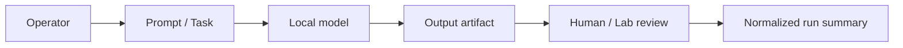

# D001 - Filesystem Loop Flow

```mermaid
flowchart LR
  Operator[Operator] --> Prompt[Prompt / Task]
  Prompt --> Model[Local model]
  Model --> Output[Output artifact]
  Output --> Review[Human / Lab review]
  Review --> Summary[Normalized run summary]
```

Source: historical lab state.
