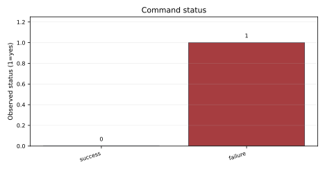
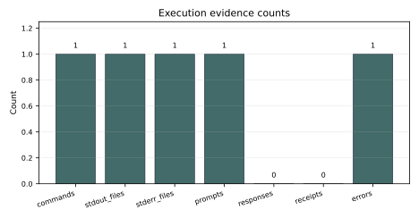
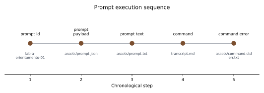

# filesystem-loop 20260526-real-fsloop Report

## Summary

This is a one-prompt lab run created by `run.sh --prompt-id lab-a-orientamento-01`.

## Prompt

- Prompt id: lab-a-orientamento-01
- Prompt kind: yai-prompt
- Prompt payload: `assets/prompt.json`

## Execution Result

```sh
target/debug/yai prompt < assets/prompt.txt
```

Exit code: 2

## Metrics

`metrics.json` records the command exit code and prompt id.

## Evidence / Artifacts

- `assets/command.stderr.txt`
- `assets/command.stdout.txt`
- `assets/prompt.json`
- `assets/prompt.txt`

## Limitations

This run makes no model quality claim, provider readiness claim, hardware benchmark claim or benchmark superiority claim.

<!-- yai-generated-report:start -->
## Run evidence summary

This generated section is composed from existing run files only: `transcript.md`, `metrics.json`, `manifest.json` and `assets/`.

| Field | Value | Source |
| --- | --- | --- |
| Lab | filesystem-loop | metrics.json / manifest.json |
| Run slug | 20260526-real-fsloop | metrics.json / manifest.json |
| Command exit code | 2 | metrics.json:command_exit_code |
| commands | 1 | transcript.md + assets/ |
| stdout files | 1 | transcript.md + assets/ |
| stderr files | 1 | transcript.md + assets/ |
| prompts | 1 | transcript.md + assets/ |
| responses | 0 | transcript.md + assets/ |
| receipts | 0 | transcript.md + assets/ |
| errors | 1 | transcript.md + assets/ |

## What was executed

| Item | Value | Source |
| --- | --- | --- |
| Command | `target/debug/yai prompt < assets/prompt.txt` | transcript.md |
| Exit code | 2 | metrics.json |
| Prompt id | lab-a-orientamento-01 | metrics.json:measurements |
| Resolved prompt payload | `assets/prompt.json` | assets/prompt.json |
| First stderr line | subject:llm-provider has not entered case:new12-filesystem; run `yai case enter` first | assets/command.stderr.txt |

## Metrics table

| Metric | Value | Source |
| --- | --- | --- |
| status | command_recorded | metrics.json:status |
| command_exit_code | 2 | metrics.json:command_exit_code |
| prompt_id | lab-a-orientamento-01 | metrics.json:measurements |
| prompt_kind | yai-prompt | metrics.json:measurements |

## Generated figures

### C001 - Command status



Caption: The recorded command exit code is 2. Diagnostic figure.

Source data: `metrics.json:command_exit_code`

Limitation: Diagnostic execution status only; this is not a benchmark or quality measurement.

### C002 - Execution evidence counts



Caption: Counts summarize observable evidence channels captured by the run. Diagnostic figure.

Source data: `transcript.md`, `assets/command.stdout.txt`, `assets/command.stderr.txt`, `metrics.json`

Limitation: Counts are inferred from run files and do not measure correctness, latency or model quality.

### C003 - Prompt execution sequence



Caption: The sequence shows prompt/request evidence and the captured command outcome.

Source data: `transcript.md`, `assets/prompt.json`, `assets/prompt.txt`, `assets/command.stdout.txt`, `assets/command.stderr.txt`

Limitation: The sequence is categorical and chronological; it does not score response quality.

## Artifact index

| Path | Class | Present |
| --- | --- | --- |
| assets/C001-command-status.svg | generated figure | yes |
| assets/C002-execution-evidence-counts.svg | generated figure | yes |
| assets/C003-prompt-response-sequence.svg | generated figure | yes |
| assets/command.stderr.txt | log | yes |
| assets/command.stdout.txt | log | yes |
| assets/generated-figures.json | generated figure index | yes |
| assets/generated-tables.md | generated report tables | yes |
| assets/prompt.json | prompt artifact | yes |
| assets/prompt.txt | prompt artifact | yes |

## Missing measurements

- Benchmark throughput, hardware, VRAM and model-quality measurements: Not measured
- Command duration or endpoint timing: Not measured
- Filesystem receipt evidence: Not measured
- Model or command response sequence: Not measured
- Pack fixture use during run: Not measured

## Interpretation

- The recorded command stopped with exit code 2.
- The first captured stderr line is: `` subject:llm-provider has not entered case:new12-filesystem; run `yai case enter` first ``.
- The run used prompt catalog item `lab-a-orientamento-01` and preserved the resolved prompt payload.
- The filesystem-loop prompt did not reach model response evidence because the case entry precondition was not satisfied.
- No model-quality or benchmark conclusion is drawn from this run.

## Limitations

- Generated evidence is derived only from existing run metrics and assets.
- The report makes no model-quality or benchmark superiority claim.
- Diagnostic figures show evidence availability or status; they do not measure quality.
- Filesystem-loop interpretation is limited to captured prompt, command, output and receipt evidence.

## Next run

- Enter `subject:llm-provider` into `case:new12-filesystem` before repeating the prompt-catalog run.
- Repeat `run.sh --prompt-id lab-a-orientamento-01` and compare transcript/report evidence.

Generated table attachment: `assets/generated-tables.md`
<!-- yai-generated-report:end -->
