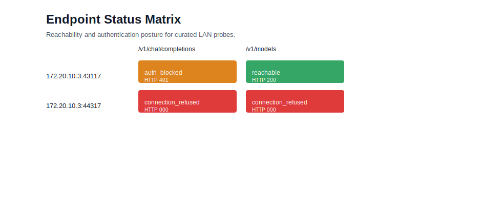
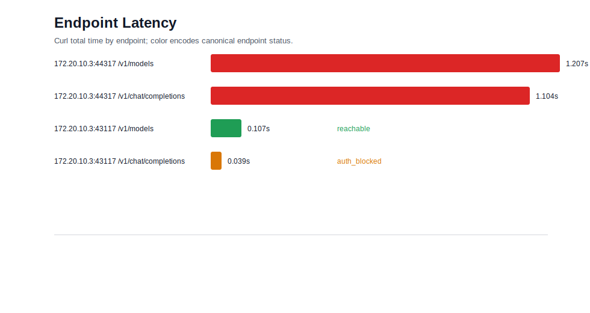
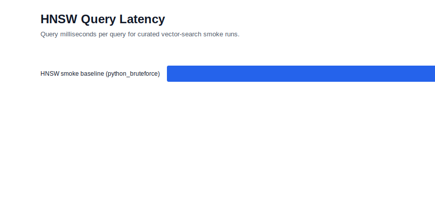

# NVIDIA LAN Provider Benchmark Report

Status: generated local lab report.

## Executive Summary

The curated LAN provider evidence shows that `172.20.10.3:43117` is the live provider port for model discovery, while `44317` is negative evidence. The provider returns `reachable` for `/v1/models` and `auth_blocked` for `/v1/chat/completions`; the current blocker is provider authentication, not LAN reachability.

Headline evidence:

- `172.20.10.3:43117 /v1/models -> reachable`
- `172.20.10.3:43117 /v1/chat/completions -> auth_blocked`
- `172.20.10.3:44317 -> connection_refused`

## Provider Readiness

| Target | Endpoint | Curl status | HTTP code | Time seconds | Status | Error |
|---|---|---|---|---|---|---|
| `172.20.10.3:44317` | `/v1/models` | 7 | 000 | 1.207051 | `connection_refused` |  |
| `172.20.10.3:44317` | `/v1/chat/completions` | 7 | 000 | 1.103605 | `connection_refused` |  |
| `172.20.10.3:43117` | `/v1/models` | 0 | 200 | 0.106771 | `reachable` |  |
| `172.20.10.3:43117` | `/v1/chat/completions` | 0 | 401 | 0.038940 | `auth_blocked` | Invalid API Key |

Caption: curated endpoint status matrix using the canonical status palette from `benchmark-visual-language.md`.

Caption: curl total time for each curated endpoint probe. Failed and blocked probes remain visible evidence.

## Model Inventory

Observed through the reachable `/v1/models` endpoint.

| Field | Value |
|---|---|
| Model id | `/home/mothx/COMPUTER_SCIENCE/DEV_CODE/YAI/yai-local-models/llm/qwen/Qwen_Qwen3-8B-Q4_K_M.gguf` |
| Owner | `llamacpp` |
| Format | `gguf` |
| Parameters | 8190735360 |
| Size bytes | 5021827072 |
| Train context | 32768 |
| Embedding size | 4096 |

## Benchmark Panels

| Run | Method | Vectors | Dimensions | Queries | k | Query ms/query |
|---|---|---|---|---|---|---|
| `hnsw-smoke-20260525-44317` | `python_bruteforce` | 1000 | 64 | 10 | 5 | 2.875458 |

Caption: vector-search smoke benchmark. This run used the standard-library fallback because NumPy and hnswlib were not installed on the operator host.

## 3D View

[Open provider topology 3D](assets/provider-topology-3d.html)

Caption: 3D boundary view separating the operator host, the live provider port, the chat authentication gate and the refused port.

## Interpretation

- Proven: the provider host responds on `43117` for `/v1/models`.
- Blocked: `/v1/chat/completions` reaches the server but returns `401 Invalid API Key`, classified as `auth_blocked`.
- Negative evidence: `44317` is retained as `connection_refused` evidence and is not treated as the live provider port.
- Missing: a valid provider API key is required before chat generation, token throughput and VRAM plots become meaningful.

## Reproducibility Appendix

| Run | Kind | Status | Raw folder |
|---|---|---|---|
| `macbook-baseline-20260525-44317` | `hardware_baseline` | `no_gpu` | `benchmarks/nvidia/macbook-baseline-20260525-44317` |
| `hnsw-smoke-20260525-44317` | `hnsw_benchmark` | `completed` | `benchmarks/nvidia/hnsw-smoke-20260525-44317` |
| `lan-provider-20260525-44317-escalated` | `lan_provider_probe` | `completed` | `benchmarks/nvidia/lan-provider-20260525-44317-escalated` |
| `lan-provider-20260525-43117-auth2` | `lan_provider_probe` | `completed` | `benchmarks/nvidia/lan-provider-20260525-43117-auth2` |

Generated at `2026-05-25T16:25:13Z` from `20260525-lan-provider`.
